# Ascend - App Flow Diagram

**App Name:** Ascend  
**Tagline:** Face Your Potential

**Based on:** QUITTR 27-screen onboarding flow

---

## Complete Application Flow (27 Screens)

```mermaid
flowchart TD
    subgraph PreQuiz["PRE-QUIZ (2 screens)"]
        S1[1. Splash/Intro<br/>Logo + Captions<br/>Auto-transition]
        S1 --> S2[2. Welcome/Intent<br/>Start Quiz CTA]
    end

    subgraph Quiz["QUIZ (10 questions)"]
        S2 --> Q1[Q1: Primary Goal<br/>Jawline/Skin/Symmetry/Glow-up]
        Q1 --> Q2[Q2: Frequency<br/>How often do you check appearance?]
        Q2 --> Q3[Q3: Source<br/>Where do you compare yourself?]
        Q3 --> Q4[Q4: Progression<br/>Has it gotten worse?]
        Q4 --> Q5[Q5: Onset<br/>When did concerns start?]
        Q5 --> Q6[Q6: Physical Impact<br/>Posture/Breathing habits]
        Q6 --> Q7[Q7: Emotional Impact<br/>Photo avoidance frequency]
        Q7 --> Q8[Q8: Stress Response<br/>Check mirror when stressed?]
        Q8 --> Q9[Q9: Trigger<br/>Boredom/Social media?]
        Q9 --> Q10[Q10: Investment<br/>Spent money on products?]
    end

    subgraph Profile["PROFILE INPUT"]
        Q10 --> S13[13. User Profile<br/>Name + Age<br/>Complete Quiz CTA]
    end

    subgraph Processing["LABOR ILLUSION"]
        S13 --> S14[14. Processing<br/>Circular Progress 0-100%<br/>Analyzing patterns...]
    end

    subgraph Results["RESULTS + DIAGNOSIS"]
        S14 --> S15[15. Results Dashboard<br/>Your Score vs Average<br/>Bar Chart Comparison]
        S15 --> S16[16. Symptom Checklist<br/>Mental/Physical/Social<br/>Multi-select]
    end

    subgraph Education["PROBLEM AGITATION"]
        S16 --> S17[17. Problem Carousel<br/>5 slides: Dopamine/Habits/Impact]
        S17 --> S18[18. Feature Value Props<br/>Illustrations + Media Logos]
    end

    subgraph SocialProof["SOCIAL PROOF"]
        S18 --> S19[19. Testimonials<br/>Verified Reviews Scroll]
        S19 --> S20[20. Progress Timeline<br/>Your Path vs Old Way Graph]
    end

    subgraph Goals["GOAL COMMITMENT"]
        S20 --> S21[21. Goal Selection<br/>Multi-select Aspirations]
        S21 --> S22[22. Social Proof Grid<br/>More Testimonials]
        S22 --> S23[23. Commitment Signature<br/>Sign Your Promise]
    end

    subgraph Personalization["PERSONALIZED PLAN"]
        S23 --> S24[24. Welcome Screen<br/>Hey Name, Welcome...]
        S24 --> S25[25. Plan Preview Card<br/>Virtual ID Card<br/>Streak: 0 days]
    end

    subgraph Paywall["CONVERSION"]
        S25 --> S26[26. Personalized Paywall<br/>Quit Date Banner<br/>Benefit Badges<br/>Become a Member CTA]
        S26 --> S27[27. Free Trial Offer<br/>Try For $0.00<br/>App Mockup Preview]
    end

    subgraph MainApp["MAIN APP"]
        S27 -->|Subscribe| HOME[Home Dashboard]
        S27 -->|Skip| HOME_FREE[Home - Limited]
        HOME --> SCAN[Camera Scan]
        SCAN --> FULL_RESULTS[Full Results]
        HOME --> ROUTINE[Daily Routine]
        HOME --> SETTINGS[Settings]
    end
```



---

## Screen-by-Screen Breakdown

### PRE-QUIZ (2 screens only)

| # | Screen | Elements | Action | Duration |
|---|--------|----------|--------|----------|
| 1 | Splash/Intro | Logo, "Embrace this pause", 5-star rating | Auto | 2-3s |
| 2 | Welcome/Intent | Header, Subheader, "Start Quiz" CTA | Tap button | - |

### QUIZ (10 questions, auto-advance)

| # | Screen | Question | Options | Action |
|---|--------|----------|---------|--------|
| 3 | Q1 | Primary goal? | Jawline / Skin / Symmetry / Overall glow-up | Single-tap |
| 4 | Q2 | How often check appearance? | Multiple times daily / Daily / Weekly / Rarely | Single-tap |
| 5 | Q3 | Where compare yourself? | Social media / Mirror / Photos / Dating apps | Single-tap |
| 6 | Q4 | Has it gotten worse over time? | Yes / No | Single-tap |
| 7 | Q5 | When did concerns start? | Age brackets | Single-tap |
| 8 | Q6 | Physical habits? | Mouth breathing / Poor posture / Both / Neither | Single-tap |
| 9 | Q7 | Avoid photos of yourself? | Always / Sometimes / Rarely / Never | Single-tap |
| 10 | Q8 | Check mirror when stressed? | Frequently / Sometimes / Rarely | Single-tap |
| 11 | Q9 | Triggered by boredom/social media? | Yes / No | Single-tap |
| 12 | Q10 | Spent money on appearance products? | Yes / No | Single-tap |

### PROFILE + PROCESSING

| # | Screen | Elements | Action |
|---|--------|----------|--------|
| 13 | User Profile | Name input, Age input, "Complete Quiz" CTA | Text + Tap |
| 14 | Labor Illusion | Circular progress 0-100%, "Analyzing patterns...", "Processing data..." | Auto 5-6s |

### RESULTS + DIAGNOSIS

| # | Screen | Elements | Action |
|---|--------|----------|--------|
| 15 | Results Dashboard | Bar chart (Your Score vs Average), "X% higher concern than average", "Check your symptoms" CTA | Tap CTA |
| 16 | Symptom Checklist | Multi-select list: Mental (unmotivated, low confidence), Physical (posture, skin), Social (avoid photos, compare constantly) | Multi-tap + Continue |

### EDUCATION (Problem Agitation)

| # | Screen | Elements | Action |
|---|--------|----------|--------|
| 17 | Problem Carousel | 5 slides with icons: "Your brain is wired for comparison", "Social media hijacks dopamine", "The cycle destroys confidence", "Most don't realize the damage", "Recovery is possible" | Swipe/Auto |
| 18 | Feature Value Props | Illustrations, Media logos (if applicable), Benefit text | Swipe |

### SOCIAL PROOF

| # | Screen | Elements | Action |
|---|--------|----------|--------|
| 19 | Testimonials | Scrollable cards: Avatar, Name, Verified badge, 5 stars, Quote | Scroll |
| 20 | Progress Timeline | Dual-line graph: "The old way" (spiky relapses) vs "With Ascend" (smooth progress), "76% faster results" caption | Scroll |

### GOAL COMMITMENT

| # | Screen | Elements | Action |
|---|--------|----------|--------|
| 21 | Goal Selection | Multi-select pills: Stronger jawline, Clear skin, Better symmetry, More confidence, Consistent routine | Multi-tap |
| 22 | Social Proof Grid | 2-column masonry testimonials | Scroll |
| 23 | Commitment Signature | "Sign your commitment", White signature canvas, "Clear" button | Draw signature |

### PERSONALIZED PLAN

| # | Screen | Elements | Action |
|---|--------|----------|--------|
| 24 | Welcome Screen | "Hey [Name], Welcome to Ascend, your path to transformation." | Auto 1.8s |
| 25 | Plan Preview Card | Virtual ID card with: Logo, "Active Streak: 0 days", Name, "Started: [Today's date]" | Auto 2.2s |

### CONVERSION (Paywall)

| # | Screen | Elements | Action |
|---|--------|----------|--------|
| 26 | Personalized Paywall | Target date banner ("Transform by: [Date+60days]"), Benefit badges from goals, Star rating, "Become a Member" CTA, Feature list | Scroll + Tap |
| 27 | Free Trial Offer | App mockup preview, Green checkmark, "No Payment Due Now", "Try For $0.00" CTA | Tap |

---

## Simplified Linear Flow

```
Splash → Welcome → Q1-Q10 → Profile → Processing → Results → Symptoms → 
Education Carousel → Features → Testimonials → Timeline → Goals → 
More Proof → Signature → Welcome → Plan Card → Paywall → Trial → Home
```

**Total: 27 screens before main app**

---

## Key Differences from Current Implementation

| Current App | QUITTR Flow | Fix Required |
|-------------|-------------|--------------|
| 7 pre-quiz screens | 2 pre-quiz screens | Remove 5 screens |
| 12 quiz questions | 10 quiz questions | Reduce to 10 |
| No profile input | Name + Age before processing | Add profile screen |
| Basic processing | Variable velocity progress bar | Enhance animation |
| No symptom checklist | Multi-select symptoms | Add screen |
| No education carousel | 5-slide problem agitation | Add carousel |
| No testimonials scroll | Verified testimonials | Add screen |
| No progress timeline | Dual-line comparison graph | Add screen |
| No signature | Commitment signature canvas | Add screen |
| No plan preview card | Virtual ID card | Add screen |
| Basic paywall | Date banner + badges + $0.00 | Enhance paywall |

---

## Technical Animation Specs

### Splash Screen
- Caption entrance: Staggered fade-in, 500ms per line, ease-out
- Text offset: Slide from y:+10px to y:0
- Auto-transition after 2.5s

### Quiz Auto-Advance
- Selection highlight: 350ms green fill
- Transition: Crossfade with scale 0.98→1.0
- Easing: cubic-bezier(0.4, 0, 0.2, 1)

### Labor Illusion Progress
- Variable velocity: 0-25% fast, 25-65% slow, 65-100% fast
- Total duration: 5.5-6.5 seconds
- Status text changes at 5%, 70%, 100%

### Results Bar Chart
- Staggered growth: Average bar first (600ms), User bar second (1200ms)
- User bar overshoots visually to amplify concern

### Signature Canvas
- Ink: 4px black stroke with Bezier smoothing
- Minimum stroke length for validation: 50 units
- Auto-advance on touchEnd after valid stroke

### Plan Card
- Entrance: SlideUp + Spring damping (0.7, stiffness 120)
- Idle: Light glint sweep every 2.5s, subtle Y-axis float ±5px

---

## Psychological Flow

```
PASSIVE INVESTMENT (Splash/Welcome)
    ↓
ACTIVE INVESTMENT (10 Quiz Questions)
    ↓
IDENTITY CAPTURE (Name/Age)
    ↓
LABOR ILLUSION (Processing)
    ↓
PROBLEM AMPLIFICATION (Results + Symptoms)
    ↓
EDUCATION (Carousel + Features)
    ↓
SOCIAL PROOF (Testimonials + Timeline)
    ↓
ASPIRATION (Goals)
    ↓
COMMITMENT (Signature)
    ↓
OWNERSHIP (Plan Card)
    ↓
CONVERSION (Paywall + $0.00 Trial)
```
