# Aesthetic Optimizer - App Flow Diagram

## Full Application Flow (Mermaid)

```mermaid
flowchart TD
    subgraph Launch["🚀 App Launch"]
        A[LaunchScreenView] --> B{hasCompletedOnboarding?}
    end

    subgraph Onboarding["📋 12-Question Clinical Assessment (~3 min)"]
        B -->|No| Q1[Q1: Primary Goal<br/>🎯 Jawline/Skin/Symmetry/Glow-up]
        Q1 --> Q2[Q2: Age<br/>👤 COPPA Verification]
        Q2 -->|Under 13| BLOCK[❌ Age Blocked<br/>COPPA Compliance]
        Q2 -->|13+| Q3[Q3: Photo Confidence<br/>📸 Always/Sometimes/Rarely/Avoid]
        Q3 --> Q4[Q4: Struggles<br/>⚠️ Mouth breathing/Posture/Skin/Chin]
        Q4 --> Q5[Q5: Current Routine<br/>✨ None/Basic/Intermediate/Advanced]
        Q5 --> Q6[Q6: Sleep Hours<br/>🌙 <6/6-7/8+]
        Q6 --> Q7[Q7: Daily Commitment<br/>⏰ 10 min/day? Yes/Maybe/No]
        Q7 --> Q8[Q8: Timeframe<br/>📅 2 weeks/1 month/3 months]
        Q8 --> Q9[Q9: Previous Blockers<br/>🚧 Knowledge/Consistency/No plan/Time]
        Q9 --> Q10[Q10: Breathing Type<br/>💨 Nose/Mouth/Unsure]
        Q10 --> Q11[Q11: Dedication Level<br/>🔥 1-10 Slider]
        Q11 --> Q12[Q12: Start AI Scan<br/>🤖 Final Action Button]
    end

    subgraph Conversion["💰 Conversion Funnel"]
        Q12 --> ANALYZE[AnalyzingView<br/>⏳ Fake Processing Animation<br/>• Scanning mandible...<br/>• Assessing symmetry...<br/>• Comparing 50K+ data points...]
        ANALYZE --> TEASE[ResultsTeaseView<br/>🔒 Blurred Results Tease<br/>• X Critical Areas Found<br/>• Potential Score: X.X/10]
        TEASE --> PAYWALL[PersonalizedPaywallView<br/>💳 Dynamic Pricing<br/>• References quiz answers<br/>• Social proof: 12K+ users<br/>• From 6.5 to X.X roadmap]
    end

    subgraph PostPurchase["✅ Subscribed User Flow"]
        PAYWALL -->|Subscribe| DISCLAIMER[DisclaimerView<br/>⚖️ Legal Disclaimer]
        PAYWALL -->|Skip/Later| HOME_FREE[HomeViewDark<br/>🏠 Limited Features]
        DISCLAIMER --> HOME[HomeViewDark<br/>🏠 Main Dashboard]
    end

    subgraph MainApp["📱 Core App Experience"]
        B -->|Yes + Subscribed| HOME
        HOME --> CAMERA[CameraView<br/>📷 AI Facial Scan]
        CAMERA --> RESULTS[ResultsView<br/>📊 Full Analysis<br/>• Symmetry Score<br/>• Jaw Definition<br/>• Skin Quality<br/>• Eye Area<br/>• Overall Rating]
        HOME --> ROUTINE[DailyRoutineView<br/>📝 Daily Exercises<br/>• Mewing<br/>• Posture<br/>• Skincare]
        HOME --> SETTINGS[SettingsView<br/>⚙️ Preferences<br/>• Notifications<br/>• Data Export<br/>• Subscription]
        RESULTS --> ROUTINE
        ROUTINE --> HOME
    end

    subgraph Retention["🔄 Retention Loops"]
        HOME --> STREAK[StreakViewModel<br/>🔥 Streak Counter]
        STREAK --> CELEBRATION[CelebrationView<br/>🎉 Milestone Rewards]
        CELEBRATION --> HOME
    end

    %% Styling
    style Launch fill:#1a1a2e,stroke:#00d4ff,color:#fff
    style Onboarding fill:#0f0f1a,stroke:#7c3aed,color:#fff
    style Conversion fill:#1a0a1a,stroke:#ff6b6b,color:#fff
    style PostPurchase fill:#0a1a0a,stroke:#10b981,color:#fff
    style MainApp fill:#1a1a1a,stroke:#00d4ff,color:#fff
    style Retention fill:#1a1a0a,stroke:#f59e0b,color:#fff
    
    style BLOCK fill:#7f1d1d,stroke:#ef4444,color:#fff
    style PAYWALL fill:#4c1d95,stroke:#a855f7,color:#fff
    style ANALYZE fill:#1e3a5f,stroke:#3b82f6,color:#fff
    style TEASE fill:#3f1e5f,stroke:#8b5cf6,color:#fff
```



---

## Screen Inventory

| Screen | File | Purpose | Key Elements |
|--------|------|---------|--------------|
| LaunchScreenView | `LaunchScreenView.swift` | App launch animation | Logo, gradient background |
| OnboardingQuizView | `OnboardingQuizView.swift` | 12-question assessment | Progress bar, option buttons, slider |
| AnalyzingView | `AnalyzingView.swift` | Fake processing animation | Progress bars, technical copy |
| ResultsTeaseView | `ResultsTeaseView.swift` | Blurred results tease | Potential score, critical areas count |
| PersonalizedPaywallView | `PersonalizedPaywallView.swift` | Conversion paywall | Pricing, features, social proof |
| DisclaimerView | `DisclaimerView.swift` | Legal disclaimer | Terms acceptance |
| HomeViewDark | `HomeViewDark.swift` | Main dashboard | Streak, scan button, quick actions |
| CameraView | `CameraView.swift` | AI facial scan | Camera preview, capture button |
| ResultsView | `ResultsView.swift` | Full analysis display | Scores, metrics, recommendations |
| DailyRoutineView | `DailyRoutineView.swift` | Exercise checklist | Tasks, completion tracking |
| SettingsView | `SettingsView.swift` | App settings | Notifications, export, subscription |
| CelebrationView | `CelebrationView.swift` | Streak milestones | Confetti, achievements |

---

## Quiz Question Flow Detail

```mermaid
flowchart LR
    subgraph Phase1["🎯 Commitment Phase"]
        Q1[Goal] --> Q2[Age]
    end
    
    subgraph Phase2["😰 Problem Amplification"]
        Q2 --> Q3[Photo Confidence]
        Q3 --> Q4[Struggles]
    end
    
    subgraph Phase3["📊 Gap Analysis"]
        Q4 --> Q5[Routine Level]
        Q5 --> Q6[Sleep]
    end
    
    subgraph Phase4["✅ Micro-Commitment"]
        Q6 --> Q7[Daily Commitment]
        Q7 --> Q8[Timeframe]
    end
    
    subgraph Phase5["🚀 Objection Handling"]
        Q8 --> Q9[Previous Blockers]
        Q9 --> Q10[Breathing Type]
    end
    
    subgraph Phase6["🔥 Self-Labeling"]
        Q10 --> Q11[Dedication 1-10]
        Q11 --> Q12[Start Scan]
    end

    style Phase1 fill:#1e40af,stroke:#3b82f6,color:#fff
    style Phase2 fill:#7f1d1d,stroke:#ef4444,color:#fff
    style Phase3 fill:#166534,stroke:#22c55e,color:#fff
    style Phase4 fill:#854d0e,stroke:#eab308,color:#fff
    style Phase5 fill:#581c87,stroke:#a855f7,color:#fff
    style Phase6 fill:#9a3412,stroke:#f97316,color:#fff
```



---

## Psychological Principles by Question

| Question | Principle | Effect |
|----------|-----------|--------|
| Q1: Goal | Commitment/Consistency | Sets "North Star" - user commits to a direction |
| Q2: Age | Personalization | Implies AI adjusts for developmental stage |
| Q3: Photo Confidence | Problem Amplification | Reminds them of pain they want to solve |
| Q4: Struggles | Specific Identification | Validates app understands looksmaxxing terms |
| Q5: Routine | Gap Analysis | Positions app as "missing piece" |
| Q6: Sleep | Variables of Success | Increases "scientific" perception |
| Q7: Daily Commitment | Micro-Commitment | Gets agreement before showing price |
| Q8: Timeframe | Urgency | Frames subscription as "fast track" |
| Q9: Blockers | Objection Pre-emption | Promises to solve specific hurdles |
| Q10: Breathing | Authority (Mewing) | Targets core looksmaxxing demographic |
| Q11: Dedication | Self-Labeling | High scores = higher payment intent |
| Q12: Start Scan | Momentum | Transitions survey → active feature |

---

## Conversion Funnel Metrics (Target)

```
Quiz Start:     100%
Quiz Complete:  80-90% (10-20% drop-off is acceptable)
Analyze View:   80-90%
Results Tease:  80-90%
Paywall View:   75-85%
Conversion:     30-50% of paywall viewers (vs ~10-15% for quick flows)
```

**Key Insight:** Losing 10-20% during quiz is acceptable because remaining users are 5x more likely to convert due to sunk cost effect.
